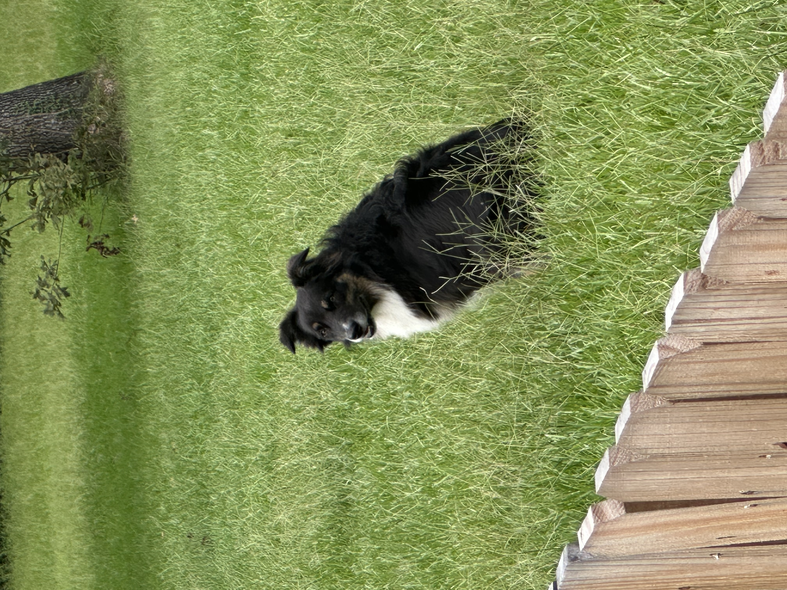

# Python-Experiment
This repository contains the initial code I created when learning to use GitHub as part of DSCI 8133, *Foundations of Data Science* at Mississippi State University.

## Plan
Future plans for this repository include adding a sample data file and a [Jupyter](https://jupyter.org/) notebook that will interact with the file.

## About Me
My name is Roger Ramriez, and I am a professor of **Mathematics** at Houston City College. I enjoy Data Science because it combines my passion for mathematics and programming into an applicable area.
My data science competencies include:
- Computer Vision
- Exploratory Data Analysis
- Python Programming
- Statistical Analysis

In order to test the include of a photograph, I've included a photo of my dog, Bowie, sitting in my backyard. Yes, he is named after David Bowie.

